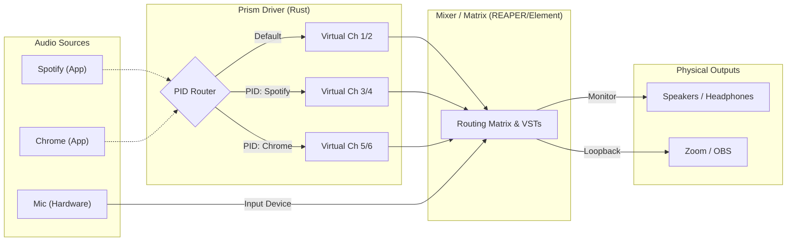

# **Project: Prism \- Rust Audio Routing Driver (Design Doc)**

## **1\. 概要 (Overview)**

macOSにおいて、OmnibusやLoopbackのような高価な商用ソフトウェアと同等の「アプリケーションごとのオーディオルーティング」を、Rustを用いた自作ドライバ「**Prism**」と既存のDAW（REAPER等）の組み合わせにより、低コストかつ高パフォーマンスで実現する。

### **ネーミングコンセプト: Prism (プリズム)**

「混ざり合った白い光（システム音声）」を入射させると、屈折率の違い（PID）によって美しいスペクトル（個別のチャンネル）に分離して出力される物理現象になぞらえている。

### **核心となるアイデア**

* **Unix哲学 (Do one thing and do it well):**  
  * **Prism Driver:** アプリケーションの識別（PID判定）と、チャンネルへの振り分け（Demux）に特化する。  
  * **DAW / Mixer:** ミキシング、エフェクト、マトリクスルーティング、モニタリングを担当する。

## **2\. システムアーキテクチャ (Architecture)**

### **全体構成図**

### **データフロー**

1. **Input:** アプリケーション（Spotify等）は、Prismドライバを「通常のスピーカー」として認識し、音声データを出力する。  
2. **Demux (Prism):** ドライバは書き込みに来たプロセスのPIDを識別し、内部のマッピングテーブルに基づいて、リングバッファ上の「特定のオフセット（チャンネル）」にデータを書き込む。  
3. **Mixing (DAW):** REAPER等は、Prismドライバを「多チャンネル入力デバイス」として認識。Ch 3-4にはSpotify、Ch 5-6にはChromeの音が分離されて入ってくる。  
4. **Output:** DAW上で自由にルーティング（マトリクス接続）し、物理スピーカーや配信ソフトへ送る。

## **3\. 技術スタック (Tech Stack)**

### **Driver Development**

* **Language:** Rust (Edition 2021\)  
* **Target:** macOS Core Audio HAL Plug-in (AudioServerPlugIn)  
* **Bundle Name:** Prism.driver  
* **Crates:**  
  * coreaudio-sys: Core Audio C APIへのバインディング（必須）  
  * libc: Cの型定義  
  * syslog: ログ出力用  
  * *(Note: coreaudio-rs はクライアント用のため使用不可)*  
* **Key Strategy:**  
  * macro\_rules\! を使用してCOMインターフェース（V-Table）のボイラープレートを削減。  
  * DoIOOperation 内は完全な **Lock-free / No-allocation** 実装とする。

### **Mixing / Control**

* **Software:** REAPER (推奨: Matrix View) または Element (Node Graph)  
* **Latency Setting:** 64 samples @ 48kHz (〜1.3ms)

## **4\. レイテンシとモニタリング戦略**

### **分離の原則**

「許される遅延」と「許されない遅延」を経路レベルで分離する。

1. **Vocal / Instrument (許されない遅延):**  
   * **経路:** Audio Interface \-\> Direct Monitor (Hardware) \-\> Headphones  
   * **遅延:** **0ms**  
   * PrismドライバやDAWのバッファサイズの影響を一切受けない。  
2. **Apps / BGM (許される遅延):**  
   * **経路:** App \-\> Prism Driver \-\> DAW \-\> Output  
   * **遅延:** 10ms 〜 20ms (Buffer \+ Processing)  
   * リスナーにとっては相対的なズレがないため、聴感上の問題はない。  
   * 動画視聴（YouTube等）時のリップシンクも、10ms程度なら人間の知覚限界以下であり問題なし。

## **5\. 実装ロードマップ (Roadmap)**

### **Phase 1: スケルトンの作成 (The Skeleton)**

* cdylib としてRustプロジェクト prism\_driver を作成。  
* Info.plist を含むバンドル構造 (Prism.driver/Contents/MacOS/Prism) を作成。  
* AudioServerPlugInMain エントリーポイントを実装。  
* coreaudiod にロードさせ、ログに "Prism initialized" を出す。

### **Phase 2: "土管"の実装 (Pass-through)**

* BlackHole 相当の機能を実装。  
* リングバッファの実装（Atomicな読み書きポインタ管理）。  
* DoIOOperation で、入力されたデータをそのまま出力バッファへコピーする。  
* サンプリングレートのプロパティ (kAudioDevicePropertyNominalSampleRate) を実装し、OS側のSRC（Sample Rate Conversion）機能を利用可能にする。

### **Phase 3: PIDルーティングの実装 (The Magic)**

* ドライバ内で「PID → ターゲットチャンネル」のマッピングテーブルを持つ。  
* DoIOOperation 内でクライアントのPIDを判定。  
* memcpy の宛先アドレス（オフセット）をPIDに応じて動的に変更するロジックを実装。  
* (Optional) 外部からマッピングを変更するためのIPC（Unix Domain Socket等）の実装。

### **Phase 4: UXの向上**

* **チャンネル名の通知:** kAudioElementPropertyName を実装し、DAW側に「Input 3 (Spotify)」のような名前を表示させる。  
* **ステータスアプリ (Optional):** 現在のルーティング状況を可視化するGUIアプリ（Tauri/Swift）。

## **6\. 開発のヒント & 注意点**

* **サンプリングレート:**  
  * Prismドライバ内でSRC（リサンプリング）処理を書く必要はない。  
  * ドライバは常に自身のレート（例: 48kHz）を報告し、アプリとの不一致はOS (Core Audio Daemon) に任せる。  
* **Rustの安全性:**  
  * IOスレッド内では Vec::new(), Mutex::lock(), println\!() は厳禁。  
  * unsafe ブロックが多くなるため、ポインタ演算のオフセット計算には細心の注意を払う。  
* **既存コードの活用:**  
  * OSSの Background Music (BGM\_Device.cpp) のロジックが最大の参考資料となる。